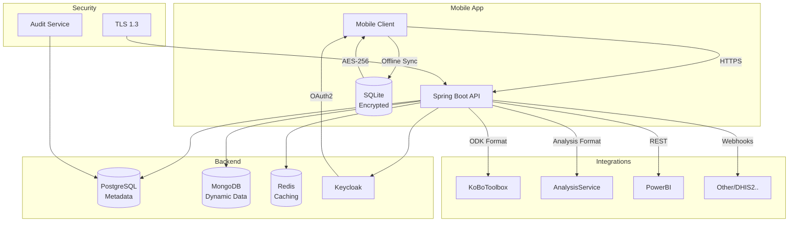
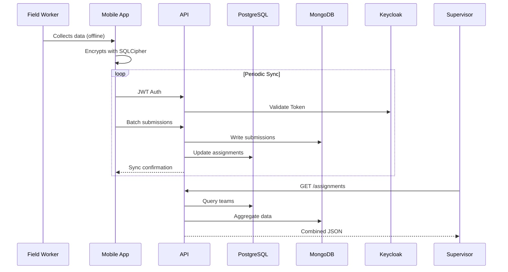
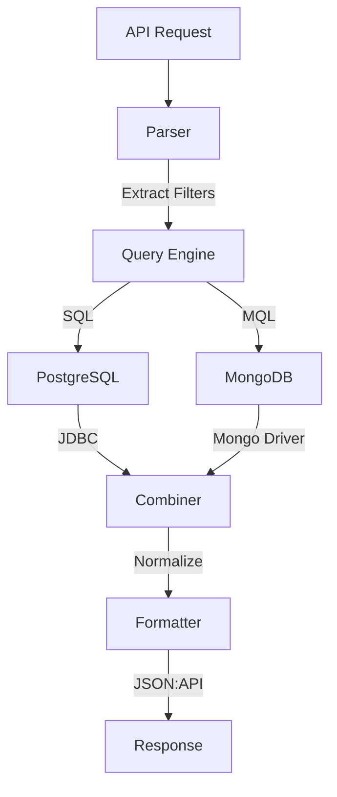
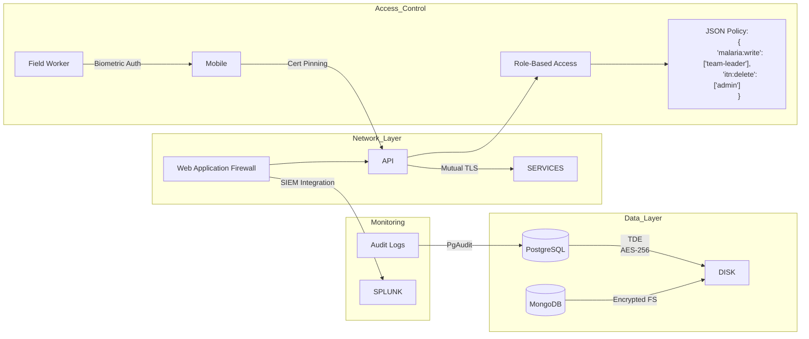
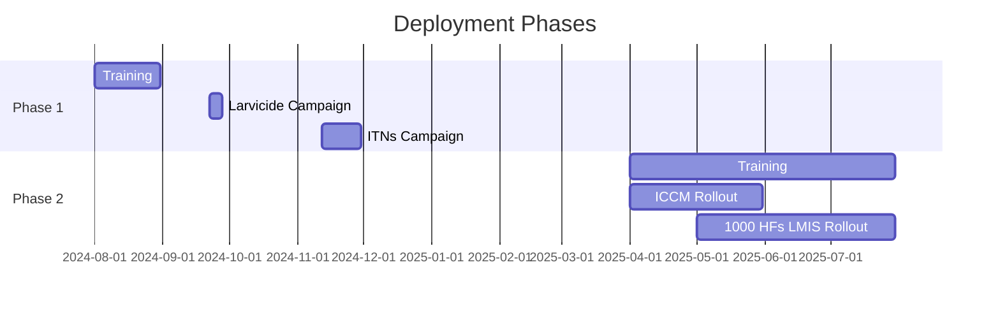

# DataRun System  
**National Malaria Control Program (NMCP), Yemen**  
*Comprehensive Data Management Solution for Malaria Control Operations*
## Executive Summary  
DataRun is a purpose-built, modular data management platform designed to streamline NMCP's field operations, data collection, and intervention planning. Developed in-house with zero licensing costs, it offers full ownership, offline functionality, and seamless integration with existing health systems. Key benefits include enhanced data integrity, real-time decision-making tools, and adaptable workflows for malaria-specific campaigns.
## 1. Introduction

### 1.1 Purpose

This document provides a comprehensive overview of the DataRun system, designed specifically for managing activities and data for the National Malaria Control Program (NMCP). It serves as a foundational reference for understanding the system’s architecture, features, and functionalities, and is intended to guide ongoing development, maintenance, and integration with other health information systems.

### 1.2 Scope  
Covers system architecture, core features, security protocols, and strategic advantages. Designed to facilitate informed decisions on nationwide rollout and integration.  

**Resource Portal**:  
Access live documentation, API guides, and updates at [https://docs.nmcpye.org](https://docs.nmcpye.org).

---

## 2. DataRun System Overview

### 2.1 Description & Value Proposition

**What is DataRun?**  
DataRun is a dynamic, modular data management system tailored to the NMCP’s needs. It supports field operations by dynamically configuring projects, activities, teams, assignments, and organizational units (including field warehouses). Its key value propositions include:

| **Feature**       | **Typical Systems**       | **DataRun**                  |  
|--------------------|---------------------------|------------------------------|  
| **Cost**           | $5k+/year subscriptions  | **Zero licensing fees**      |  
| **Control**        | Vendor-locked            | Full NMCP ownership          |  
| **Customization**  | Generic templates        | Malaria-optimized workflows  |  
| **Data Hosting**   | Offshore servers         | On-premise/Yemeni cloud      |  


### 2.2 High-Level Architecture

**System Modules:**

- **Mobile App:**  
  - Provides offline data capture with encrypted local storage (SQLite with AES-256).
  - Synchronizes data via HTTPS and supports real-time authentication using OAuth2.

- **Backend Services:**  
  - **Spring Boot API:** Connects to both PostgreSQL (for metadata) and MongoDB (for dynamic data) and utilizes Redis for caching.
  - **Authentication:** Managed by Keycloak, ensuring secure role-based access.
  
- **Integrations:**  
  - Supports formats like ODK, RESTful API integrations (e.g., PowerBI, DHIS2), and webhooks for seamless interoperability.
  
- **Security:**  
  - Implements TLS 1.3 for secure communications.
  - Employs an audit service to log and monitor all user interactions.

**Architecture Diagram:**



### 2.3 System Objectives

DataRun is engineered to:

- **Enhance Data Management:** Streamline the collection, processing, and storage of NMCP-related data.
- **Support Informed Decision-Making:** Provide robust tools and reports for effective malaria control and prevention.
- **Enable Field Data Collection:** Allow offline data collection in remote areas with later synchronization.
- **Ensure Data Integrity:** Maintain strict data quality and traceability standards.
- **Improve Intervention Planning:** Leverage reusability of activity data to optimize cost and planning efficiency.

### 2.4 Key Features

- **Project Management:**  
  - Capture departmental efforts as distinct projects (e.g., ITNs distribution, larvicide campaigns).

- **Field Activities:**  
  - Target entities such as locations, health facilities, or individuals.
  - Manage tasks like team supervision, resource distribution, and data collection.

- **Assignments & Tracking:**  
  - Link activities with teams, organizational units, and scheduling.
  - Use reference forms to track locations and resource allocations.

- **Dynamic Data Forms:**  
  - Create customizable data collection forms to capture relevant, activity-specific data.
  - Support offline data entry with subsequent synchronization.

- **Data Visualization:**  
  - Generate pivot tables, charts, and dashboards for effective data analysis and reporting.

- **Interoperability:**  
  - Open API architecture allows easy integration with platforms such as DHIS2, ODK, HRMS, LMIS, and supply chain systems.

---

## 3. Mobile & Data Collection

### 3.1 Dynamic Data Collection Forms

- **Form Templates:**  
  - Support multiple field types (e.g., integer, date, entity references).
  - Customizable for specific activities and team assignments.

### 3.2 Mobile-First Design

- **Offline-First Functionality:**  
  - Allow form completion without connectivity; sync data when online.
  
- **User Modes:**  
  - **Supervisors:** Access real-time summaries and transaction histories.
  - **Field Users:** seamless data entry with dynamic form rendering.
  
- **Key Technologies:**  
  - **SQLite:** For secure, local storage (AES-256 encryption).
  - **WorkManager:** For scheduling background sync tasks.
  - **Conflict Resolution:** Configurable mechanisms (e.g., last-write-win, server-win) with versioning.

### 3.3 Data Flow



---

## 4. Backend Architecture

### 4.1 Hybrid Database Setup

DataRun utilizes a hybrid database approach:

- **PostgreSQL:**  
  - Manages structured metadata (users, teams, assignments, organizational units).
  
- **MongoDB:**  
  - Stores dynamic data including forms, submissions, and rapidly evolving entities.

```plaintext
                 +---------------------+
                 |   Spring Boot API   |
                 +----------+----------+
                            |
           +----------------+-----------------+
           |                                  |
+----------+----------+             +---------+----------+
| PostgreSQL (RDBMS)  |             | MongoDB (NoSQL)    |
| - Users             |             | - Data Forms       |
| - Teams             |             | - Submissions      |
| - Assignments       |             | - Dynamic Entities |
| - OrgUnits          |             | - ... Other        |
| - ...Other          |             +--------------------+
+---------------------+
```

### 4.2 Advanced API Capabilities

#### Hybrid Query Engine

The engine supports advanced querying with virtual joins across PostgreSQL and MongoDB, enhanced by a Redis caching layer.

**Example API Query:**

```http
GET /api/v1/dataSubmissions?query={
  "$and": [
    {"assignment.region": "Aden"}, 
    {"submissionDate": {"$gte": "2023-10-01"}},
    {"status": "approved"}
  ]
}&fields=["team.id","items.count"]&page=2&size=50
```

**Engine Execution Flow:**



---

## 5. Security and Compliance

### 5.1 Security Measures

- **End-to-End Encryption:**  
  - Encrypts data in transit (TLS 1.3 with certificate pinning) and at rest (SQLCipher, AES-256-XTS).
  
- **Authentication & RBAC:**  
  - OAuth2 with Keycloak ensures secure, role-based access control.
  
- **Audit Trails:**  
  - Comprehensive logging using PostgreSQL Audit Extensions for immutable record keeping.

### 5.2 Security Architecture



**Compliance Standards:**

- Yemeni Ministry of Health Privacy Guidelines
- WHO Malaria Data Standards

---

## 6. Use Case: ITNs Distribution Campaign

**Workflow Overview:**

1. **Central Warehouse:**  
   - Allocate 10,000 nets.
   - Create assignments:
     - **Team A:** 5,000 nets.
     - **Team B:** 5,000 nets.

2. **Field Operations:**  
   - Field teams scan QR codes.
   - Submit distribution forms capturing:
     - Nets received (5,000)
     - Nets distributed (e.g., 4,872)
     - GPS verification (e.g., -12.3, 44.5)

3. **Dashboard Reporting:**  
   - Real-time dashboards indicate 97.4% coverage.
   - Automatic flagging of discrepancies greater than 2%.

**Roles:**

- **Supervisor:**  
  - Registers daily resource movements.
  - Accesses real-time summaries and detailed logs.
  
- **Field Team:**  
  - Receives assignments based on planned distributions.
  - Uses dynamic forms for data entry (both offline and online).

---

## 7. Implementation Roadmap

### 7.1 Summary of Key Strengths

- **Comprehensive Data Management:**  
  - Dynamic data collection paired with robust backend analytics.
- **Flexible Integration:**  
  - Open API enabling seamless connectivity with other systems.
- **Enhanced Data Security:**  
  - End-to-end encryption and detailed audit trails ensuring compliance.

### 7.2 Next Steps

- **Pilot Deployment:**  
  - Roll out DataRun in one department and gather stakeholder feedback.
  
- **Iterative Improvement:**  
  - Use pilot insights to further customize and scale the solution.

**Implementation Timeline:**



**Resource Requirements:**

- NMCP Technical Working Group Training  
- Field Coordinator Training
---

## 9. Visual Interfaces

### 9.1 Activities and User Management

- **Activities Management:**  
  

- **Teams Management:**  
  

- **User Management:**  
  

### 9.2 Form Templates and Elements

- **Data Elements Management:**  
    
  

- **Options and OptionSets:**  
    
  

### 9.3 Form Template Builder

- **Main Screen:**  
  

- **Template Management:**  
  

- **Sections & Data Elements Selection:**  
    
  

- **Rules and Expressions:**  
    
  
